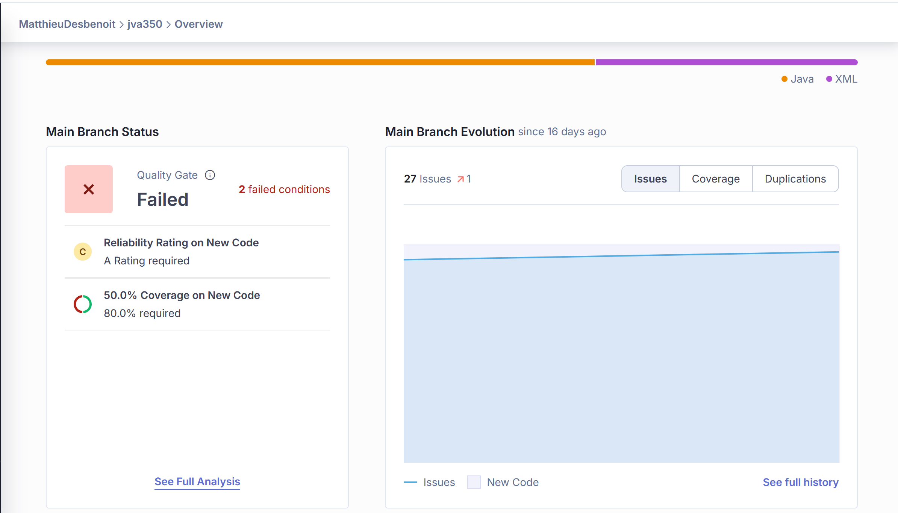
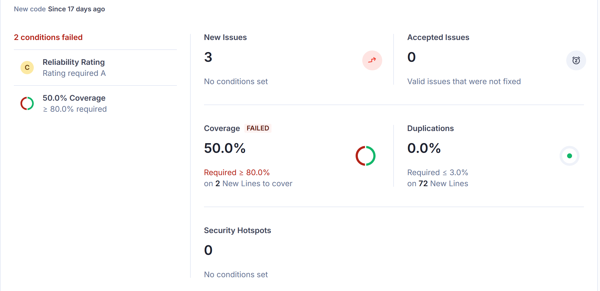

# TD et TP IPI JVA350 Qualité logicielle

## Pré-requis

- Avoir installé un IDE :
  - IntelliJ Ultimate, avec votre adresse IPI sur Jetbrains Student à https://www.jetbrains.com/student/
  - sinon Eclipse, à https://www.eclipse.org/downloads/packages/release/2022-09/r/eclipse-ide-java-developers
- Savoir utiliser Git et les branches (utilisez les capacités Git de votre IDE ou installez-le séparément depuis
https://git-scm.com/download/win ). Quelques liens :
  - https://learngitbranching.js.org/
  - https://git-scm.com/book/en/v2/Git-Branching-Basic-Branching-and-Merging
- Avoir un compte Github. Voici comment y configurer l'authentification de git par clé SSH :
  - https://docs.github.com/en/authentication/connecting-to-github-with-ssh
  - https://docs.github.com/en/authentication/connecting-to-github-with-ssh/adding-a-new-ssh-key-to-your-github-account
- Connaître les bases du développement Java avec Maven (la persistence avec JPA est également utilisée ponctuellement),
  et au moins comment importer et compiler un projet Java dans l'IDE :
  - IntelliJ :
    - Installation de Git : Git > git not installed > Donwload and install
    - Cloner un projet Github : Git > Clone
    - Configuration d'un projet Maven : clic droit sur pom.xml > Add as Maven project ou bien voir IV-B-2 à https://damienrieu.developpez.com/tutoriel/java/nouveautes-intellij-12/?page=page_1
    - Installation de Java : par exemple
      - erreur ne trouve pas le symbol "java" : clic droit sur pom.xml > Build > sur Setup DSK choisir Configure > choisir Download et install
      - "Error running..." : Project JDK is not specified > Configure... > no SDK > Add SDK > Download
    - lancer un build maven complet : Run > Edit configurations > Maven > Create configuration > mettre Working directory au dossier du projet et dans Command line, écrire : clean install
    - problème de sécurisation de connexion :
    (Maven error : unable to find valid certification path to requested targetmaven unable to find valid certification path to requested target
    ou
    unable to access 'https://github.com/mdutoo/ipi-jva350-tptd.git/': SSL certificate problem: unable to get local issuer certificate)
    mvn clean package -Dmaven.wagon.http.ssl.insecure=true -Dmaven.wagon.http.ssl.allowall=true
    ou dans IntelliJ Run > Edit Configurations > Java Options (sans -D) : maven.wagon.http.ssl.insecure=true maven.wagon.http.ssl.allowall=true
    comme dit à https://stackoverflow.com/questions/45612814/maven-error-pkix-path-building-failed-unable-to-find-valid-certification-path
  - sinon Eclipse : voir https://thierry-leriche-dessirier.developpez.com/tutoriels/java/importer-projet-maven-dans-eclipse-5-min/

## TD

### Plateforme d'intégration continue

- forkez ce repository sur votre compte Github.
  - Puis après chaque question, committez et pushez vos réponses sur votre repository.
- sur ce repository, configurez un build automatisé Maven.
  - indice : Github Actions > Java with Maven > Configure > Start commit
  - vérifiez d'abord la configuration proposée
- vérifiez que le workflow correspondant a été committé, et qu'un job de build a été lancé
- suivre les bonnes pratiques : à chaque commit, si son build casse, ne pas le laisser dans cet état !

### Plateforme d'évaluation de la qualité

- Connectez-vous à https://sonarcloud.io/ en vous identifiant à l'aide de votre compte Github
- Créez un projet Sonar Cloud pour votre repository forké :
  - New Project > sélectionnez votre repoisitory forké
  - Analyse new project > Create a project manually > Créer un token comme indiqué et copiez-le dans un fichier temporaire
  - Paramétrez l'analyse avec les actions Github comme indiqué
  - ajoutez dans le workflow Github la configuration de l'analyse Sonar Cloud du code
- Rédigez **ci-dessous** une courte analyse du premier rapport produit par Sonar (métriques, état général...) :

Le premier rapport Sonar indique...

### Tests unitaires

Dans tous les cas :
- créez la classe de test si nécessaire, et une ou plusieurs méthodes de test
- les tests doivent couvrir autant de cas que possible
- vous pouvez corriger le code de la méthode testée si nécessaire

Questions :
- Tests unitaires simples : Testez unitairement la méthode `SalarieAideADomicile.aLegalementDroitADesCongesPayes()`.
Pensez aux cas aux limites (quand on fait évoluer les valeurs en entrée, le moment où elles font changer le résultat).
Sa javadoc contient une copie de ses spécifications métier (ce à quoi elle est sensée
servir), tirée de https://femme-de-menage.ooreka.fr/comprendre/conges-payes-femme-de-menage .
- Tests paramétrés : Testez par une méthode de test paramétrée la méthode `SalarieAideADomicile.calculeJoursDeCongeDecomptesPourPlage()`.
Aide : pour lire une date depuis du texte, utiliser LocalDate.parse(<date au format ISO8601 ex. 2022-11-01>).
Pour information, cette méthode suit les spécifications métier exprimées à https://femme-de-menage.ooreka.fr/comprendre/conges-payes-femme-de-menage
et notamment clarifiées dans les Exemples 1 et 2 visibles en cliquant sur "Congés payés femme de ménage : décompte des jours"
puis en regardant le tableau sous "Vacances" (et non "Absences").
- Tests avec mocks : Testez de manière mockée (sans dépendance à la base de données) la méthode `SalarieAideADomicileService.ajouteConge()`.
Elle fait plusieurs choses et il y a donc plusieurs choses à tester.

### Tests d'intégration

- Tests de repository : Testez la méthode `SalarieAideADomicileRepository.findByNom()`. Aide : pour qu'il y ait des
données dans la base, utilisez la méthode `save()` du repository.
- Tests d'intégration de service : Créez un test d'intégration d'un exemple d'usage typique de la méthode `SalarieAideADomicileService.ajouteConge()`. Aide : une aide supplémentaire à la création des objets en base est
fournie par la méthode `SalarieAideADomicileService.creerSalarieAideADomicile()`. Mais attention, elle fait des
vérifications qui peuvent nécessiter la réinitialisation de la base dans les tests (en méthode annotée @BeforeEach) !

### Tests d'acceptation

Cucumber est installé dans le projet : maven exécute dans les tests également les Features cucumber définies dans
src/test/resources, en prenant comme définition de leurs Steps celles trouvées dans des méthodes annotées (suprise !)
@Given, @When, @Then. Tout cela grâce aux bonnes dépendances Maven dans le pom.xml, et la bonne extension Junit
configurée dans la classe RunCucumberTest, fournies par l'exécution de l'archetype Maven comme indiqué dans le
tutorial officiel à https://cucumber.io/docs/guides/10-minute-tutorial/ .

Regarder l'exemple qui fonctionne dans la classe StepDefinitions et le fichier de Feature is_it_friday.feature, repris
du même tutorial.

S'en inspirer pour écrire la Feature puis développer les Step nécessaires dans StepDefinitions pour écrirer un test
d'acceptation validant la fonctionnalité de clôture de mois d'un salarié aide à domicile.

### Maintenabilité

- conventions de codage : faites les respecter, améliorez la lisibilité du code
- journalisation : rajoutez du logging aux endroits les plus pertinents. Changez la configuration pour que les messages de log aillent en plus dans un nouveau fichier `error.log`
- documentation : améliorez la documentation du code où c'est nécessaire. Générez localement la JavaDoc en utilisant Maven.
- Rajoutez en entrée de ce README les badges Sonar des métriques importantes de votre projet, en utilisant l'API web de Sonar : https://sonarcloud.io/web_api/api/project_badges

## TP d'évaluation

Une fois le TD fini, réalisez les travaux de l'évaluation dans une branche "evaluation" créée à partir de la branche "master" de votre repository forké.

Si validé en séance, l'évaluation doit être effectuée "pair programming" et donc en binôme, entre étudiants de niveaux différents, en se "passant le clavier" entre chaque question mais en utilisant quand même chacun successivement son propre compte github.

Dans tous les cas :
- assurez-vous que le build passe (compilation, tests) et qu'il n'y a aucune alerte Sonar bloquante, critique ou majeur (Code Smells, anomalies, bugs). Vous pouvez corriger le code originel si nécessaire.
- efforcez-vous d'avoir une couverture de code à 100% sur les méthodes testées plus bas. BONUS : même chose mais avec la couverture de code avec mutation.

### Revue de code et pair programming :

- Si cela vous est permis, vous êtes invités à réaliser travaux de l'évaluation en Pair Programming, en vous associant
avec un autre étudiant. Dans ce cas, partez du repository forké jugé le plus complet ou mieux noté par Sonar des deux,
passez-vous le clavier au moins entre 2 questions, et indiquez qui le tenait par l'utilisateur de votre commit.
- Sinon, une fois le TP d'évaluation fini, créez sur Github une Pull Request de votre branche "evaluation" vers la
branche "master" et demandez à un autre étudiant de faire la revue de votre code. Les cas échéant, faites les
corrections demandées.

#### Comment travailler en pair programming en binôme en pratique avec les outils utilisés :

Si vous choisissez cette option, voici 2 solutions.

1. La solution triviale :
comme Git n'est pas le sujet du cours (et contrairement à ce que j'ai dit en séance), avec votre binôme vous pouvez
simplement choisir un seul de vos ordinateurs et entrer chacun une réponse successivement dans le même projet Git.
Vous devrez alors m'indiquer quel est le binôme dont ce n'est pas le projet à l'origine, par exemple dans chaque commit
pour lequel il a tenu le clavier.

2. La solution Git :
choisissez un seul de vos 2 projets forkés, qui contiendra vos réponses communes.Son créateur y invite son binôme :
depuis la page Github du projet, Settings > Collaborators and Teams > Manage access, puis le rechercher, et le rajouter
avec les droits Write. Son binôme doit alors accepter l'invitation en cliquant dans le mail qu'il reçoit.
Son binôme importe ce projet dans son IDE :
- git clone ...
- dans IntelliJ : File > Open > choix du dossier du projet cloné (ou du dossier parent, pour pouvoir travailler
simultanément sur tous les projets qui y sont, par exemple copier des bouts de code depuis son propre ancien
projet) > Where would you like to open the project ? New window (ce qui permet de garder son propre ancien projet
ouvert, ou This window pour le remplacer)
- faire marcher sa compilation (dans IntelliJ, clic droit sur pom.xml > Add as Maven project)
- Chacun à son tour récupère la dernière version (git pull), écrit la réponse avec le regard et les conseils de l'autre,
l'envoie (git commit ; git push)

NB. il y a encore nombre d'autres solutions : le binôme dont le projet n'a pas été choisi forke le projet choisi puis
fait des pull request dans le projet choisi, ou rajoute la remote du projet choisi dans le sien...

### TDD

- Faites du TDD pour tester unitairement la méthode `Entreprise.estDansPlage()` : écrire d'abord les tests entièrement
(pensez aux cas limites) et seulement ensuite écrivez le code de la méthode. Indiquez dans un commentaire une chose ou
deux que vous auriez peut-être fait différemment sans faire de TDD.

### Tests unitaires

- Tester unitairement (de manière paramétrée) la méthode `Entreprise.estJourFerie()` OU BIEN
`Entreprise.proportionPondereeDuMois()` et `Entreprise.getPremierJourAnneeDeConges()`. **Attention**, elles contiennent
des erreurs, bon débogage ! Améliorez l'ensemble de la qualité de cette méthode, avec l'aide de Sonar.
- Testez sans dépendance à la base de données la méthode `SalarieAideADomicileService.calculeLimiteEntrepriseCongesPermis()`

### Tests d'intégration

- Tests de repository : Testez la méthode `SalarieAideADomicileRepository.partCongesPrisTotauxAnneeNMoins1()`
- Tests d'intégration de service : Créez un test d'intégration d'un exemple d'usage typique de la méthode `SalarieAideADomicileService.calculeLimiteEntrepriseCongesPermis()`
- BONUS Ecrire un test d'acceptation Cucumber pour au moins la partie "ancienneté" la fonctionnalité de calcul
de limite de congés permis par l'entreprise.

### Maintenabilité

- conventions de codage : pareil, faites les respecter, améliorez la lisibilité du code
- journalisation : Changez la configuration pour réaliser la rotation des fichiers de logs tous les jours et que chaque
fichier ne dépasse pas 1 MO.
- BONUS : Créez une petite documentation statique en utilisant MkDocs.
- Rédigez **ci-dessous** une courte analyse du rapport produit par Sonar (métriques, évolution, état général...) :

Le rapport Sonar final indique...

### Rendu
Etat au Début du TP :

